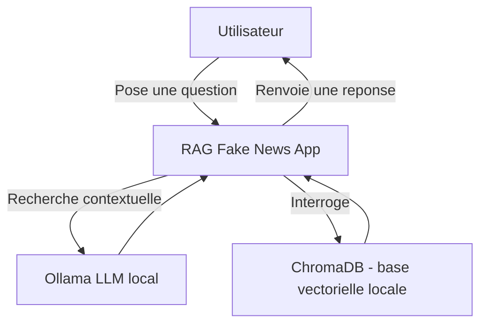
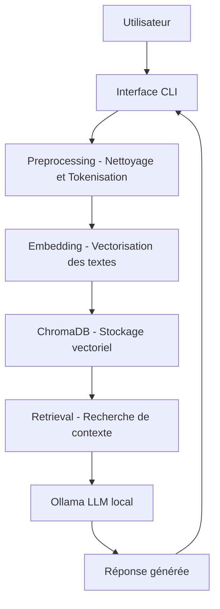
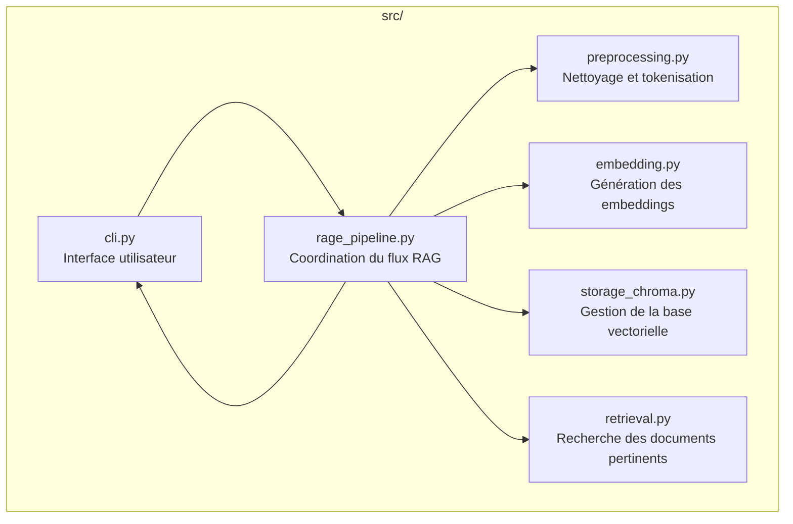
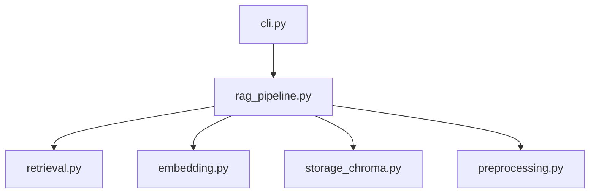
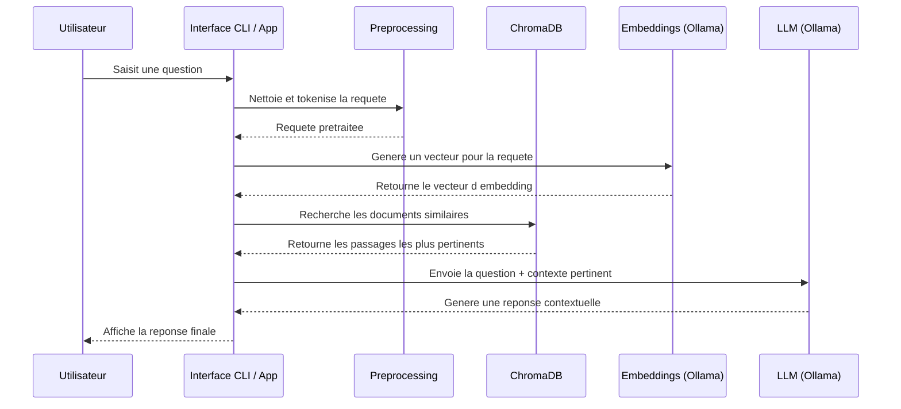

# fake_news_rag
Système RAG pour la détection de fake news 

## Structure projet (Modèle C4)
<details>
    <summary> Modèle C4 </summary>
### Visualisation figma
[Schéma projet Fake News Rag](https://www.figma.com/board/Cv7FSdZAQXQ49bazw3m81t/Sans-titre?node-id=0-1&t=elai7Kr7pmQxHEUO-1)

### C1 - Contexte système

### C2 - Containers



### C3 - Composants internes



### C4 - Vue Code


</details>
## Diagramme de séquence



## Installation

### Créer un environnement virtuel

```bash
cd ~/fake_news_rag
python3 -m venv .venv
source .venv/bin/activate
```

### Installer les dépendances

```bash
pip install -r requirements.txt
```
## Installer Ollama

### Installation

```bash
sudo snap install ollama

```

### Vérification de l'installation

```bash
ollama list

```

### Installer un LLM

```bash
# Modèle pour l'embedding pour ChromaDB
ollama pull all-minilm
# Modèle plus 'gros'
ollama pull llama3.2
```

### Vérifier que le modèle réponde

```bash
cd ~/tests
python test_ollama.py
```

## Architecture du projet

```
rag-fake-news/
├─ data/
│  ├─ raw/                 # Données brutes
│  │   ├─ true.csv
│  │   └─ fake.csv
│  └─ processed/           # Données nettoyées pour l'embedding
├─ src/
│  ├─ preprocessing.py
│  ├─ embedding.py
│  ├─ storage_chroma.py
│  ├─ retrieval.py
│  ├─ rag_pipeline.py
│  └─ cli.py
├─ tests/                    # Destiné aux tests
│  ├─ test_preprocessing.py
│  ├─ test_embedding.py
│  ├─ test_retrieval.py
│  └─ ...
├─ notebooks/
├─ requirements.txt
└─ README.md

```
