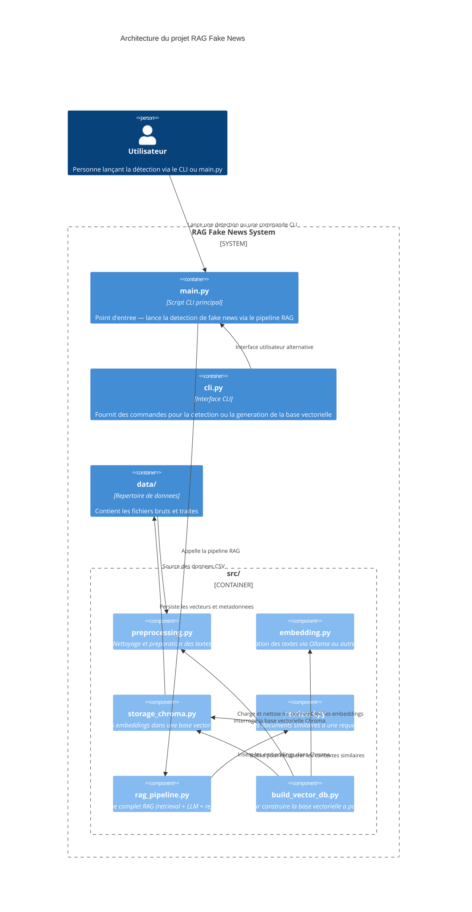
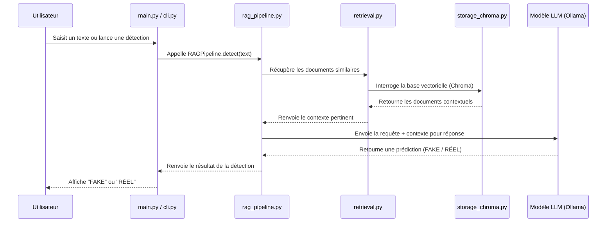

# fake_news_rag
Système RAG pour la détection de fake news 

## Structure projet (Modèle C4)



## Diagramme de séquence


## Installation

### Créer un environnement virtuel

```bash
cd ~/fake_news_rag
python3 -m venv .venv
source .venv/bin/activate
```

### Installer les dépendances

```bash
pip install -r requirements.txt
```
## Installer Ollama

### Installation

```bash
sudo snap install ollama

```

### Vérification de l'installation

```bash
ollama list

```

### Installer un LLM

```bash
# Modèle pour l'embedding pour ChromaDB
ollama pull all-minilm
# Modèle plus 'gros'
ollama pull llama3.2
```

### Vérifier que le modèle réponde

```bash
cd ~/tests
python test_ollama.py
```

## Architecture du projet

```
rag-fake-news/
├─ data/
│  ├─ raw/                 # Données brutes
│  │   ├─ true.csv
│  │   └─ fake.csv
│  └─ processed/           # Données nettoyées pour l'embedding
├─ src/
│  ├─ preprocessing.py     # Module de traitements des données (chargement & nettoyage)
│  ├─ embedding.py         # Module de vectorisation des articles (embedding & normalisation)
│  ├─ storage_chroma.py    # Module de création la base vectorielle (chargement & insertion)
│  ├─ retrieval.py         # Module mise en relation entre prompt utilisateur et base vectorielle 
│  ├─ rag_pipeline.py      # Pipeline RAG
│  ├─ build_vector_db.py   # Pipeline de création de base vectorielle (traitement -> vectorisation -> insertion des données)
│  └─ cli.py               # Gestion en ligne de commande de l'application (démarré via main.py)
├─ tests/                    # Destiné aux tests
│  ├─ test_preprocessing.py
│  ├─ test_ollama.py         # Permet de vérifier la liste des modèles installés et de vérifier leur fonctionnement
│  ├─ test_embedding.py
│  ├─ test_retrieval.py
│  └─ ...
├─ notebooks/
├─ main.py                 # Script de lancement du CLI / Démarrage de l'app
├─ app.py                  # Module de création de l'interface streamlit (disponible sur la branche new_branch)
├─ requirements.txt
└─ README.md

```

- Il subsiste des différences d'architecture et de code en fonction des branches consultés.
- La branche explo_get est dédiée à l'utilisation de détecteur depuis une interface en ligne de commande.
- La branche développée par Emese (new_branch) est dédiée au développement d'une interface streamlit.
  
## Procédures

## Via Command Line Interface (CLI)

Disponible sur la branche explo_get

### Traitement -> Vectorisation -> Création & Insertion des données

La première étape consiste à créer un dossier data sous la forme :
```
├─ data/
│  ├─ raw/                 # Données brutes
│  │   ├─ true.csv
│  │   └─ fake.csv
│  └─ processed/           # Dossiers accueillant les données traitées
```

Dans le dossier data/raw/, insérer les csv True et Fake 
[Lien vers les datasets](https://www.kaggle.com/datasets/clmentbisaillon/fake-and-real-news-dataset/data)

Une fois le dossier data en place, il est désormais possible de lancer le pipeline :

- Traitements des données -> Création d'un dossier /processed dans /data
- Vectorisation 
- Création de la base vectorielle avec ChromaDB
- Insertion des données avec création d'une collection nommé "articles"

**Le processus de vectorisation est susceptible de prendre beaucoup temps (~1h) selon la puissance de votre machine.**


### Système RAG

```
python main.py
```

Appuyer sur 1 pour la création de la base vectorielle

Appuyer sur 2 pour faire une détection

## Détection via CLI

- Coller le texte correspondant à l'article à analyser (en anglais)
- Lancement du RAG
- Génération de la réponse au format :
  
```
Verdict: TRUE / FALSE
Reason: <justification>
```

## Via streamlit

 Disponible via la branche new_branch

 ### Démarrage streamlit

```
streamlit run app.py
```

- Dans la zone de saisie de texte, saisir/coller un article à analyser
- Régler le nombre de chunks de référence (panneau latéral gauche)
- Cliquer sur le bouton "Lancer l'analyse"

Résultat avec verdict + affichage des chunks de références avec label.


