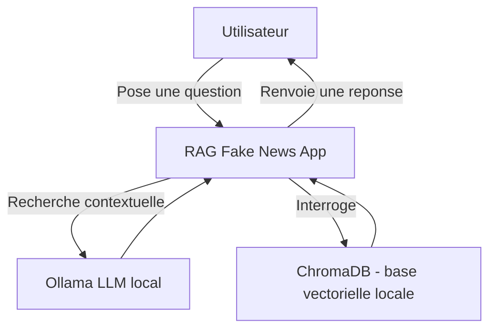
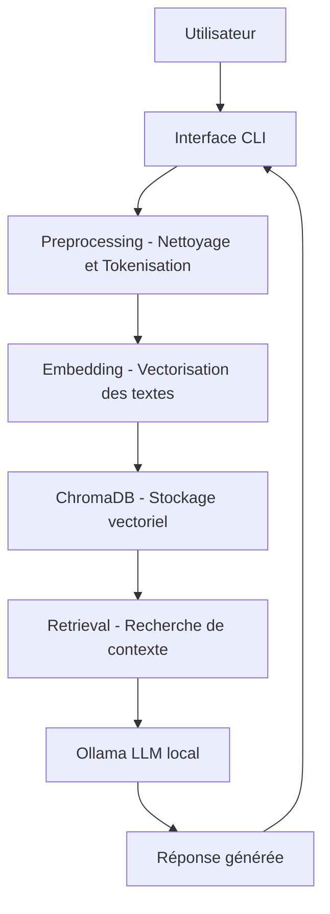
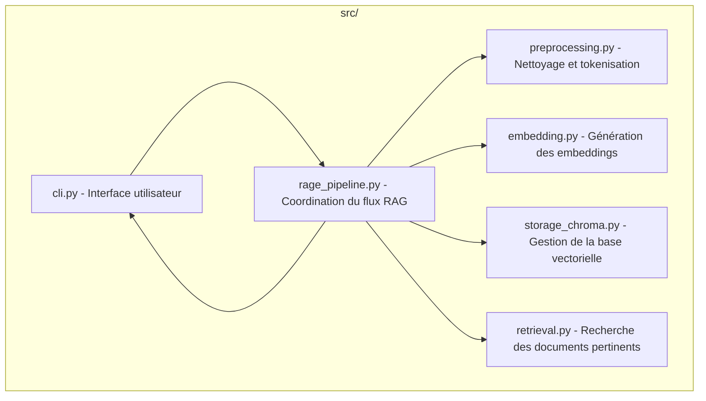
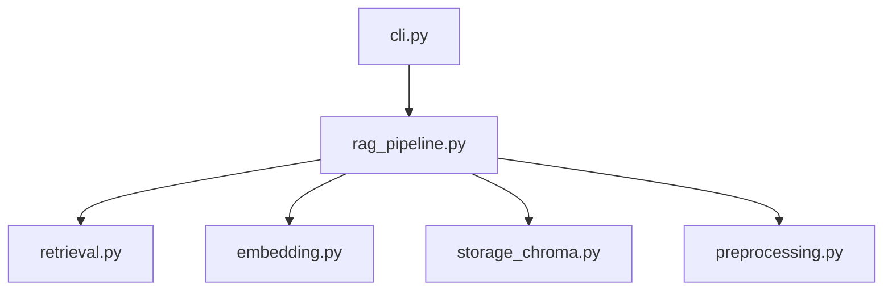
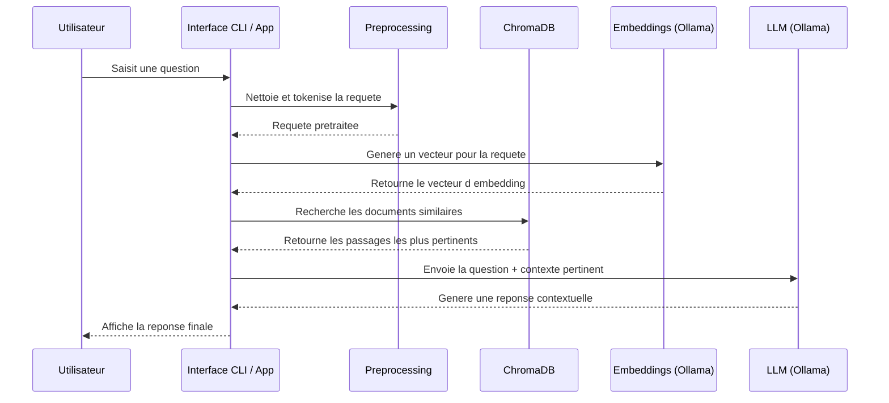

# fake_news_rag
Système RAG pour la détection de fake news 

## Structure projet (Modèle C4)

### Visualisation figma
[Schéma projet Fake News Rag](https://www.figma.com/board/Cv7FSdZAQXQ49bazw3m81t/Sans-titre?node-id=0-1&t=elai7Kr7pmQxHEUO-1)

### C1 - Contexte système

### C2 - Containers



### C3 - Composants internes



### C4 - Vue Code



## Diagramme de séquence



## Installation

### Créer un environnement virtuel

```bash
cd ~/fake_news_rag
python3 -m venv .venv
source .venv/bin/activate
```

### Installer les dépendances

```bash
pip install -r requirements.txt
```
## Installer Ollama

### Installation

```bash
sudo snap install ollama

```

### Vérification de l'installation

```bash
ollama list

```

### Installer un LLM

```bash
# Modèle pour l'embedding pour ChromaDB
ollama pull all-minilm
# Modèle plus 'gros'
ollama pull llama3.2
```

### Vérifier que le modèle réponde

```bash
cd ~/tests
python test_ollama.py
```

## Architecture du projet

```
rag-fake-news/
├─ data/
│  ├─ raw/                 # Données brutes
│  │   ├─ true.csv
│  │   └─ fake.csv
│  └─ processed/           # Données nettoyées pour l'embedding
├─ src/
│  ├─ preprocessing.py     # Module de traitements des données (chargement & nettoyage)
│  ├─ embedding.py         # Module de vectorisation des articles (embedding & normalisation)
│  ├─ storage_chroma.py    # Module de création la base vectorielle (chargement & insertion)
│  ├─ retrieval.py         # Module mise en relation entre prompt utilisateur et base vectorielle 
│  ├─ rag_pipeline.py      # Pipeline RAG
│  ├─ build_vector_db.py   # Pipeline de création de base vectorielle (traitement -> vectorisation -> insertion des données)
│  └─ cli.py
├─ tests/                    # Destiné aux tests
│  ├─ test_preprocessing.py
│  ├─ test_ollama.py         # Permet de vérifier la liste des modèles installés et de vérifier leur fonctionnement
│  ├─ test_embedding.py
│  ├─ test_retrieval.py
│  └─ ...
├─ notebooks/
├─ main.py                 # Script principal de lancement de détection
├─ requirements.txt
└─ README.md

```
## Procédures

### Traitement -> Vectorisation -> Création & Insertion des données

La première étape consiste à créer un dossier data sous la forme :

├─ data/
│  ├─ raw/                 # Données brutes
│  │   ├─ true.csv
│  │   └─ fake.csv
│  └─ processed/           # Dossiers accueillant les données traitées

Dans le dossier data/raw/, insérer les csv True et Fake 
[Lien vers les datasets](https://www.kaggle.com/datasets/clmentbisaillon/fake-and-real-news-dataset/data)

Une fois le dossier data en place, il est désormais possible de lancer le pipeline :

- Traitements des données -> Création d'un dossier /processed dans /data
- Vectorisation 
- Création de la base vectorielle avec ChromaDB
- Insertion des données avec création d'une collection nommé "articles"

**Le processus de vectorisation est susceptible de prendre beaucoup temps (~1h) selon la puissance de votre machine.**

```bash
~/src
python build_vector_db.py

```

### Système RAG

```bash
~/fake_news_rag
python main.py

```

Au lancement du script depuis le terminal, l'utilisateur devra copier l'article.
-> Appuyez sur ENTREE pour confirmer le collage

Le système RAG se lance et va mettre en relation le prompt/article utilisateur avec la base vectorielle et retournera
un ensemble de 3 documents similaires.

Le corps de la réponse est construit ainsi :

- Verdict : TRUE / FAKE 
- Reason : La raison qui explique le verdict
